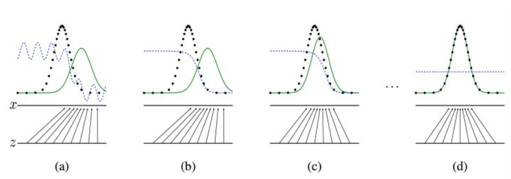
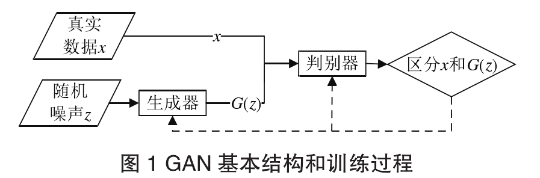

# GAN网络学习笔记

GAN本质上是一个由**生成器(Generator)**和**判别器(Discriminator)**构成的**动态博弈模型**

## 1、基本原理和基础结构

- **生成器**捕获**真实数据分布**，根据给定噪声生成新的对抗样本

>注：图中的**黑色虚线**表示真实的样本的分布情况，**蓝色虚线**表示判别器判别概率的分布情况，**绿色实线**表示生成样本的分布。 ![[公式]](https://www.zhihu.com/equation?tex=Z) 表示噪声， ![[公式]](https://www.zhihu.com/equation?tex=Z) 到 ![[公式]](https://www.zhihu.com/equation?tex=x+) 表示通过生成器之后的分布的映射情况。
>
>我们的目标是使用生成样本分布（绿色实线）去拟合真实的样本分布（黑色虚线），来达到生成以假乱真样本的目的。
>
>可以看到在**（a）**状态处于最初始的状态的时候，生成器生成的分布和真实分布区别较大，并且判别器判别出样本的概率不是很稳定，因此会先训练判别器来更好地分辨样本。
>通过多次训练判别器来达到**（b）**样本状态，此时判别样本区分得非常显著和良好。然后再对生成器进行训练。
>训练生成器之后达到**（c）**样本状态，此时生成器分布相比之前，逼近了真实样本分布。
>经过多次反复训练迭代之后，最终希望能够达到**（d）**状态，生成样本分布拟合于真实样本分布，并且判别器分辨不出样本是生成的还是真实的（判别概率均为0.5）。也就是说我们这个时候就可以生成出非常真实的样本啦，目的达到。

- **判别器**评估所接受的输入数据是真实数据而不是生成器所生成的对抗样本的概率
  - **如果概率大于0.5，则为真实数据**
  - **如果概率小于0.5，则为对抗样本**

在这种动态博弈的训练过程中，生成器的目的是**增大判别器犯错的概率**。判别器的目的是**将真实数据和对抗样本分开**。

两者不断训练提高自身的**生成能力**和**判别能力**，**直至判别器无论怎么训练都无法区分真实样本和对抗样本，生成器无论如何改变输入参数都无法增大判别器的犯错概率**，这时生成器无法和刚开始一样通过改变自身输入来提高判别器的出错概率了，因为生成器判别器无论对于真实样本还是对抗样本输出概率都为0.5，生成器和判别器之间达到了一个**纳什平衡**。

这里有个疑问，判别器是刚开始就使用固定数量的真实数据训练好的？然后输入生成样本进行判断，它出错概率一直处于一个慢慢增大的过程，按照纳什均衡的概念没有参与者可以透过改变自身策略使自身收益，如果生成器一开始就已经通过真实数据训练好那么在和生成器博弈的过程中判别器就没法改变策略，这可以被称作博弈吗？

> **纳什平衡**（Nash equilibrium），又称为非合作博弈**均衡**，是博弈论的一个重要术语，以约翰·**纳什**命名。 在一个博弈过程中，无论对方的策略选择如何，当事人一方都会选择某个确定的策略，则该策略被称作支配性策略。 如果两个博弈的当事人的策略组合分别构成各自的支配性策略，那么这个组合就被定义为**纳什平衡**。
>
> 在[博弈论](https://zh.wikipedia.org/wiki/博弈论)中，**纳什均衡**（英语：Nash equilibrium，或称**纳什均衡点**）是指在包含两个或以上参与者的非合作博弈（Non-cooperative game）中，假设每个参与者都知道其他参与者的均衡策略的情况下，**没有参与者可以透过改变自身策略使自身受益时的一个概念解**。

在迭代对抗训练过程中，生成器希望自己生成的样本**无限接近于真实数据的数据分布**，也就是说生成器希望D(G(z))(判别器判别G(z)为真的概率)尽可能的大。

## 2、GAN算法

### 2.1 Improved GAN

**仅仅采用随机梯度下降的方法只能降低损失函数的值而无法达到纳什均衡**，基于这个限制该算法引入**特征匹配**和**批次判别**来提高模型的收敛度。

- 特征匹配：判别器从输入层到输出层由于**卷积和池化**的原因信息逐渐丢失，因此中间层携带的信息量要高于输出层，特征匹配正是基于这个原理利用损失函数使得生成样本和真实样本在经过判别器**中间层得到的特征图尽可能的相同**，这样生成器生成的样本会更加符合**真实样本的分布规律**。

  缺点是一旦生成一个真实样本就会不停的生成同样内容，不一定会达到纳什均衡，即还可以通过改变输入增大判别器的出错概率但由于不停生成同样内容导致生成器过快停止训练。个人猜测因为中间层信息量过大就会导致样本足够具体，能够生成样本的多样性会丧失因为太多信息被固定，相反的如果输出层信息较少反而生成的样本有更多的可能性。

- **批次判别**：让判别器同时判断一批样本，是生成器能生成多样性更强的对抗样本。判断一批样本都为真时达到纳什均衡？

2.2 EBGAN

2.3 Wasserstein GAN