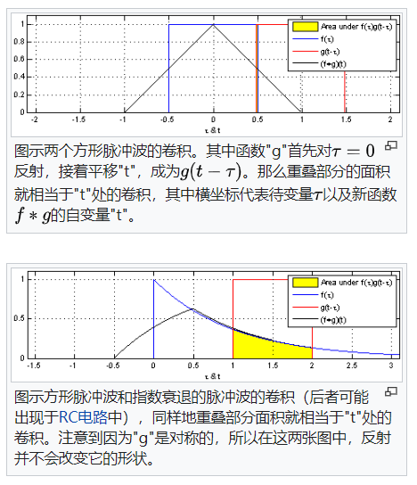
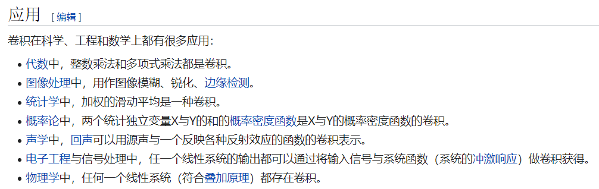

# 重要概念

## 1、导数

**导数**（英语：Derivative）是[微积分](https://zh.wikipedia.org/wiki/微积分)学中重要的基础概念。一个[函数](https://zh.wikipedia.org/wiki/函数)在某一点的导数描述了这个函数在这一点附近的变化率。导数的本质是通过[极限](https://zh.wikipedia.org/wiki/极限_(数学))的概念对函数进行局部的线性逼近。当函数的自变量在一点上产生一个增量时，函数输出值的增量与自变量增量的比值在趋于0时的极限如果存在，即为f在x处的导数

## 2、偏导数

在[数学](https://zh.wikipedia.org/wiki/数学)中，一个多变量的函数的**偏导数**（英语：partial derivative）是它关于其中一个变量的[导数](https://zh.wikipedia.org/wiki/导数)，而保持其他变量恒定（相对于[全导数](https://zh.wikipedia.org/wiki/全导数)，在其中所有变量都允许变化）

wiki：[https://zh.wikipedia.org/wiki/%E5%81%8F%E5%AF%BC%E6%95%B0](https://zh.wikipedia.org/wiki/偏导数)

## 3、梯度

在[向量微积分](https://zh.wikipedia.org/wiki/向量微積分)中，**梯度**（gradient）是一种关于多元导数的概括[[1\]](https://zh.wikipedia.org/wiki/梯度#cite_note-1)。平常的一元（单变量）函数的导数是[标量值函数](https://zh.wikipedia.org/wiki/标量值函数)，而[多元函数](https://zh.wikipedia.org/wiki/多元函数)的梯度是[向量值函数](https://zh.wikipedia.org/wiki/向量值函数)。[多元](https://zh.wikipedia.org/wiki/多元函数)[可微函数](https://zh.wikipedia.org/wiki/可微函数)在点 P上的梯度，**是以f在P上的[偏导数](https://zh.wikipedia.org/wiki/偏导数)为分量的[向量](https://zh.wikipedia.org/wiki/向量)**

就像一元函数的导数表示这个函数[图形](https://zh.wikipedia.org/wiki/函数图形)的[切线](https://zh.wikipedia.org/wiki/切线)的[斜率](https://zh.wikipedia.org/wiki/斜率)[[3\]](https://zh.wikipedia.org/wiki/梯度#cite_note-3)，如果多元函数在点P上的梯度不是零向量，它的方向是这个函数在P上最大增长的方向，而它的[量](https://zh.wikipedia.org/wiki/量_(数学))是在这个方向上的增长率[[4\]](https://zh.wikipedia.org/wiki/梯度#cite_note-4)。

考虑一座高度在(x,y)点是H(x,y)的山。H这一点的梯度是在该点[坡度](https://zh.wikipedia.org/wiki/坡度)（或者说[斜度](https://zh.wikipedia.org/wiki/斜度)）最陡的方向。梯度的大小告诉我们坡度到底有多陡。

wiki：[https://zh.wikipedia.org/wiki/%E6%A2%AF%E5%BA%A6](https://zh.wikipedia.org/wiki/梯度)

## 4、梯度下降法

**梯度下降法**（英语：Gradient descent）是一个一阶[最优化](https://zh.wikipedia.org/wiki/最优化)[算法](https://zh.wikipedia.org/wiki/算法)，通常也称为**最陡下降法**，但是不该与近似积分的最陡下降法（英语：Method of steepest descent）混淆。 要使用梯度下降法找到一个函数的[局部极小值](https://zh.wikipedia.org/wiki/最值)，必须向函数上当前点对应[梯度](https://zh.wikipedia.org/wiki/梯度)（或者是近似梯度）的*反方向*的规定步长距离点进行[迭代](https://zh.wikipedia.org/wiki/迭代)搜索。如果相反地向梯度*正方向*迭代进行搜索，则会接近函数的[局部极大值](https://zh.wikipedia.org/wiki/最值)点；这个过程则被称为**梯度上升法**。

多元函数也类似，梯度是向量，在每个变量轴上减小对应变量值即可

## 5、卷积

在[泛函分析](https://zh.wikipedia.org/wiki/泛函分析)中，**卷积**（又称**叠积**（convolution）、**褶积**或**旋积**），是透过两个[函数](https://zh.wikipedia.org/wiki/函数) *f* 和 *g* 生成第三个函数的一种数学[算子](https://zh.wikipedia.org/wiki/算子)，表征函数 *f* 与经过翻转和平移的 *g* 的乘积函数所围成的曲边梯形的面积。如果将参加卷积的一个函数看作[区间](https://zh.wikipedia.org/wiki/区间)的[指示函数](https://zh.wikipedia.org/wiki/指示函数)，卷积还可以被看作是“[移动平均](https://zh.wikipedia.org/wiki/滑動平均)”的推广。

## 6、池化

https://www.zhihu.com/question/49376084