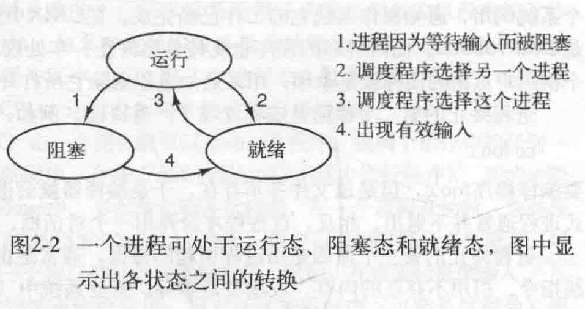

# 操作系统

## 操作系统概念

### 进程

进程本质上是**正在的执行的一个程序**，与每个进程相关的是**地址空间**，这是从某个最小值的**存储位置**通常是0到某个最大值**存储位置**的**列表**。在这个地址空间中进程可以读写，该地址空间存放有**可执行程序、程序的数据以及程序的堆栈**。与每个进程相关的还有资源集，通常包括寄存器、打开的文件清单、突出的报警、有关进程清单等。**进程基本上是容纳一个程序所需要所有信息的容器**。

用户启动一个视频编辑程序，指示它按照某个格式转换一个小时的视频，然后离开去浏览网页。同时一个被周期性唤醒、用来检查进来的电子邮件的后台程序开始运行。这样就有了三个活动进程：视频编辑器、检查电子邮件的后台进程、web浏览器。**操作系统周期性的挂起一个进程然后启动运行另一个进程，这可能是由于在过去的一两秒钟内，第一个进程已经使用完分配给它的时间片。**

一个进程暂时被挂起后，在随后的某个时刻里，该进程再次启动时的状态必须与先前暂停时完全相同，这就意味着在挂起时该进程的所有信息都要保存下来。例如与打开文件相关的指向当前位置的指针。**许多操作系统中，与一个进程相关的所有信息，除了该进程自身地址空间的内容以外，均放在操作系统的一张表中，称为进程表，进程表时数组或链表结构，当前存在的每个进程都要占用其中一项。**

一个挂起的进程包括：进程的地址空间、对应的进程表项（包括**寄存器**以及稍后重启动该进程所需要的许多**其他信息**）

与进程管理有关的最关键的系统调用是那些进行**进程创建**和**进程终止**的系统调用。考虑这种情况，一个命令解释器活shell从终端上读命令。用户输入一个命令要求编译一个程序，shell必须先创建一个新进程来执行编译程序。当执行编译的进程结束后，它执行一个系统调用终止自己。

如果进程可以创建一个或多个进程（子进程），这些进程又可以创建子进程，则可以得到进程树。

其它可用的进程系统调用包括：申请更多的内存、释放内存、**等待一个子进程结束**、用另一个程序覆盖程序

想象tcp的重传机制在两个进程上实现，为了保证一条消息的应答不会丢失，发送者要求它所在的操作系统在指定的若干秒后给一个通知，如果尚未收到确认消息就可以重发。

经过一定的时间，操作系统向该进程发送一个**警告信号(alarm signl)**，此信号让该进程暂时挂起，将寄存器的值保存到堆栈，并开始重新发送丢失的信息

系统管理器授权每个进程使用一个给定的**UID（User IDentification）**。**子进程拥有父进程一样的UID**。用户可以是每个组的成员，每个组也有一个GID

### 地址空间

较复杂的操作系统中允许在内存中同时运行多道程序。为了避免他们互相干扰，需要有某种保护机制。虽然这种机制必然是硬件形式的，但是由操作系统掌控。

虚拟内存技术。**操作系统可以把部分地址空间装入主存，部分留在磁盘上，并且在需要时来回交换它们**。本质上操作系统创建了一个**地址空间的抽象**，作为进程可以引用地址的集合。改地址空间与机器的物理内存解耦，可能大于也可能小于该物理空间。

### 文件

在读写文件前，首先要打开文件，检查其访问权限。若权限许可，系统将返回一个小整数，称作**文件描述符**，供后续操作使用。

在UNIX中另一个重要概念是**特殊文件**，提供特殊文件是为了使I/O设备看起来像是文件一般，I/O设备一个可通过系统调用进行读写。有两类特殊文件：**块特殊文件和字符特殊文件**。块特殊文件指那些可由随机存取的块组成的设备如磁盘等。字符特殊文件用于打印机、调制解调器和其他接受或输出字符流的设备。

**管道**是一种虚文件，它可连接两个进程，如果进程A和B希望通过管道对话，他们必须提前设置该管道。

### 系统调用

记住下列事项是有益的。任何单CPU计算机一次只能执行一条命令。如果一个进程正在用户态与运行一个用户程序，兵器需要一个系统调用，比如从文件读数据，那么它必须执行一个系统调用将控制转移到操作系统，操作系统根据参数查找所需要的调用进程。然后执行系统调用，并把控制返回给在系统调用后面跟随的指令，在某种意义上系统调用就像进行一个特殊的过程调用，但是只有系统调用可以进入内核，而过程调用则不能。

read系统调用：

```c
count = read(fd, buffer, nbytes)
```

count中实际返回读出的字节数。这个值和nbytes相同或更小。


- 1-3：在准备调用这个实际用来进行read系统调用的库过程中，调用程序先把参数压入堆栈。第一个和第三个参数是值调用，第二个参数通过引用传递实际传递的是地址。

- 4：对库过程的调用

- 5：在可能是由汇编语言写成的库过程中，一般吧系统调用的编号放在操作系统所期望的地方比如寄存器中

- 6：执行一个TRAP指令把用户态切换到内核态，并在内核中的一个固定地址执行

  >TRAP指令实际上与过程调用非常类似，他们后面都跟随一个来自远处位置的指令，已经共以后使用的一个保存在栈中的返回地址，即调用前的用户空间的地址。并且TRAP指令不能跳转到任意地址上，根据机器的体系结构，或者跳转到一个单固定地址上。 

- 7：跟随在TRAP指令后的内核代码开始检查系统调用编号，然后分派给正确的系统处理器，这通常通过一张由系统调用编号所引用的、指向系统调用处理器的指针表来完成

- 8：系统调用处理器运行

- 9：一旦系统调用处理器完成其工作，控制可能会跟随TRAP指令后面的指令中返回给用户空间进程，系统调用者可能堵塞调用者，避免它继续执行。例如如果试图读键盘，但是并没有任何键入，那么调用者就必须被堵塞。这种情况下，操作系统会查看是否有其他可以与运行的进程。稍后需要的输入出现时，进程会提醒系统注意，然后步骤9-11会接着进行

- 10：这个过程接着以通常的过程调用返回的方式，返回到用户程序

- 11：为了完成整个工作，用户程序还必须清除堆栈，如同它在进行任何过程调用后一样


#### 用于进程管理的系统调用

##### FORK

**fork**是唯一可以在POSIX中创建进程的途径，它创建一个原有进程的精确副本，包括所有的文件描述符、寄存器等内容。**fork之后原有的进程及其副本就分开了**。fork调用返回一个值，在子进程中该值为0，在父进程中等于子进程的**进程标识符**。

考虑shell的情形，从终端读取命令创建一个子进程，等待子进程执行命令，为了等待子进程结束父进程执行**waitpid**系统调用，等待直到子进程终结。在键入一条命令后，shell调用fork创建一个新的进程，通过使用**execve**系统调用可以实现这一点，这个系统调用会**引起整个核心映像被一个文件替代**，该文件由第一个参数给定。


waitpid第一个参数-1代表等待任何一个老的子进程，第二个参数为statloc所指向的地址是子进程的退出状态

在UNIX中进程将其存储空间划分为三段：正文段(如程序代码)、数据段(如变量)以及堆栈。数据向上增长而堆栈向下增长，夹在中间的是未使用的地址段：


### 思考问题

1、内核态和用户态有哪些区别？解释在设计操作系统时存在两种不同模式有什么帮助

2、考虑一个有两个CPU的系统，并且每一个CPU有两个线程。假设有三个程序P0、P1、P2，分别以运行5ms、10ms、20ms开始。运行这些程序需要多少时间？假设这三个程序都是100%限于CPU，在运行时无阻塞，并且一旦设定就不改变CPU。

3、在用户进程进行一个系统调用，以读写磁盘文件时，该程序提供指示说明了所需要的文件、要给指向数据缓冲区的指针以及计数。然后控制权交给操作系统，它调用相关的驱动程序。假设驱动程序启动磁盘并且直到中断发生才终止，在磁盘读的情况下，很明显，调用者会被阻塞，因为文件中没用数据。宰相磁盘写时会发生什么情况

4、什么是陷阱指令？在操作系统中解释它的用途

5、在分时系统中为什么需要进程表？

6、对于以下系统调用给出引起失败的条件：fork、exec以及unlink

7、一台计算机有一个四级流水线，每一级都花费相同的时间执行其工作即1ns。这台机器每秒可执行多少指令

8、假设一个计算机系统有高速缓存、内存（RAM）以及磁盘，操作系统用虚拟内存。读取缓存中的一个词需要1ns，RMA需要10us，磁盘需要10ms。如果缓存的命中率为95%，内存是99%（缓存失效时），读取一个词的平均时间是多少？

9、块特殊文件和字符特殊文件的差异是什么？

10、现代操作系统将进程的地址空间从机器物理内存中分离出来。列举这样设计的两个好处

## 进程与线程

进程时操作系统提供的最古老的也是最重要的抽象概念之一。即使使用的CPU只有一个也有支持伪并发的能力，它们将一个单独的CPU变换成多个虚拟的CPU。没有进程的抽象现代计算将不复存在

### 进程

#### 进程模型

在进程模型中计算机中所有可运行的软件，通常也包括操作系统被组织成若干**顺序进程**，简称进程。一个进程就是一个正在执行程序的实例，包括程序计数器、寄存器和变量的当前值。从概念上说，每个进程拥有它自己的虚拟CPU，实际的CPU在进程之间来回切换，这种快速的切换称作**多道程序设计**。


进程和程序之间的区别是很微妙的，但非常重要，用一个比喻可以理解这一点：

> 想象一位计算机科学家为他的女儿制作生日蛋糕，他有做蛋糕的食谱，厨房里有所需要的原料。在这个比喻中，食谱就是程序，计算机科学家是CPU，而原料就是输入数据。进程就是厨师阅读食谱，取来各种原料以及烘焙蛋糕的一系列动作的总和。现在假设计算机科学家的儿子被蜜蜂蛰了，计算机科学家记录下他照着食谱做到哪了然后拿出一本急救手册按照其中的指示处理蛰伤，处理完成后他又回来从离开时的那一步开始做蛋糕。

这里最关键的思想是：**一个进程是某种类型的一个活动，它有程序、输入、输出以及状态。单个处理器可以被若干进程共享，它使用某种调度算法决定何时停止一个进程的工作，转而为另一个进程服务**

值得注意的是如果一个程序运行了两边，则算作两个进程

#### 进程的创建

4种事件会导致进程的创建：

1、系统初始化

2、正在运行的程序执行了创建进程的系统调用

3、用户请求创建一个新进程

4、一个批处理作业的初始化

停留在后台处理诸如电子邮件、Web页面、新闻、打印之类的活动的进程称为**守护进程**

一个正在运行的进程经常发出系统调用，以便创建一个或多个进程协助其工作。在所要从事的工作可以容易的划分成若干**相关的但是没有相互作用的进程时**，创建新的进程就特别有效果。

fork是唯一一个可以创建新进程的系统调用,这个系统调用会创建一个**与调用进程相同的副本**。在调用了fork之后，这两个进程拥有相同的**内存映像、同样的环境字符串和同样的打开文件**。通常子进程接着执行execve或一个类似的系统调用以修改其内存映像并运行一个新的程序。

进程创建之后，父进程和子进程有各自**不同的地址空间**。如果其中某个进程在其地址空间中修改了一个字，这个修改对其它进程而言是不可见的。

#### 进程的终止

进程种终止的事件

1、正常退出，自愿的

2、出错退出，自愿的

3、严重错误，非自愿的

4、被其他进程杀死，非自愿的

第三个原因主要是一些执行非法指令、引用不存在的内存等错误

#### 进程的层次结构

在UNIX中，进程和它的所有子进程及其后裔共同组成了一个**进程组**。当用户从键盘发出一个信号时，该信号被送给当前与键盘相关的进程组中的所有成员，每个进程可以分别捕获该信号，忽略该信号或者采用默认动作，即该信号被杀死。

#### 进程的状态

进程的三种状态：

1、运行态，该时刻进程实际占用CPU

2、就绪态，可运行，但因为其他进程正在运行而暂时停止

3、阻塞态，除非某种外部事件发生，否则进程不能运行



转换操作系统发现进程不能运行下去的时候发生转换1，某些系统中进程可以执行一个系统调用进入阻塞态，当一个进程从管道或设备文件读取数据时，如果没有有效的输入，进程会被自动阻塞

转换2和转换3是由进程调度程序引起的，进程调度程序是操作系统的一部分，它的主要工作就是决定应当运行哪个进程、何时运行以及它应该运行多长时间，这是很重要的一点

使用进程模型是我们易于想象系统内部的操作状况


关于中断处理、启动进程、停止进程的具体细节都隐藏在调度程序中。

#### 进程的实现

为了实现进程模型，操作系统维护着一张表格，即进程表，每个进程占用一个表项，该表项包含了进程状态的重要信息，包括程序计数器、堆栈指针、内存分配状况、所打开的文件的状态、账号和调度信息以及其它在进程由运行态转换到就绪态或阻塞态时必须保存的信息，从而保证该进程随后能再次启动，就像从未被中断过一样。


单个cpu如何维持多个顺序进程的，与每一类I/O类关联的是要给称作中断向量的位置，它包含中断服务程序入口地址。假设当一个磁盘中断发生时，用户进程3正在运行，中断硬件将程序计数器、程序状态字、有时还有一个或多个寄存器压入堆栈，计算机随即跳转到中断向量所指示的地址然后就是软件，中断服务例程接管剩下的工作了。


#### 多道程序计算模型

如果进程用于计算的平均时间是进程在内存中停留时间的20%，即计算的概率为1/5，且内存中同时有5个进程，则CPU一直满负载运行，这个模型的前提时5个进程不会同时等待I/O

从概率的角度来看CPU利用率，假设一个进程等待I/O操作的时间与其停留在内存中的时间的比为P，当内存中有n个进程且都在等待I/O的概率即CPU空转的概率为pn。cpu利用率为1-pn。


更精确的模型应该用排队论构建，但上述的模型依然是有效的（当进程就绪时，给进程分配CPU，否则让CPU空转）。

假设计算机有8GB内存，操作系统及相关表格占2GB，每个用户程序占2GB，这些内存孕育3个用户程序同时驻留在内存中，若80%的时间用于I/O等待，则CPU的利用率为1-0.8^3，即49%。增加8GB的内存后，从三道程序设计提高到7道程序设计，cpu利用率提高到79%，换言之第二个8GB提高了30%的吞吐。主要是增加了n的大小
### 线程

在传统操作系统中，每个进程有一个地址空间和一个控制线程。

#### 线程的使用

线程存在的意义是什么？为什么一个进程中还要再有一类进程（线程），线程存在的必要性是什么。

通过将应用程序分解成可以准并行的多个顺序线程，程序设计模型会变得更简单。

- 有了进程模型的抽象，我们可以不必考虑中断，定时器，和上下文切换，而只需考察并行进程。类似的只有在有了多线程概念之后我们才加入了一种新的元素：并行实体拥有了共享同一个地址空间和所有可用数据的能力，而多进程无法共享一个地址空间和数据，这正是多进程模型不具备的。

- 另一个原因是因为线程比进程更轻量级，他比进程更容易创建也更容易撤销。

- 第三个原因涉及性能方面的讨论。若多个线程都是CPU密集型的，那么并不能获得性能上的增强，但是如果存在大量的计算（大量计算的任务单线程和多线程有区别吗？如果多个线程可以运行在不同核上是有区别的）和大量I/O处理拥有多个线程允许这些活动彼此重叠进行，从而加快应用程序的执行速度，在多CPU系统中多线程是有益的

举个例子，一个字处理软件，一个线程与用户交互，另一个在后台进行格式处理，还有一个进行持久化存储，一旦有文字变化交互线程就通知格式化线程对整本书进行处理，同时交互线程继续监控键盘和鼠标。

如果程序是单线程的，那么在备份时来自键盘和鼠标的命令就会被忽略，直到备份工作完成，另一个方法是引入中断驱动模型设计。但是如果使用三个线程，程序设计模型就会变得很简单，很显然三个进程无法做到这件事情，因为三个线程都需要对同一个文件进行操作，多个线程可以共享内存，所以他们可以访问同一个正在编辑的软件。


##### 多线程web服务器

在多数web站点上，某些页面较其它页面相比有更多的访问。利用这一事实web服务器可以把获得大量访问的页面集合保存在内存中，避免到磁盘去调用这些页面进而改变性能，这样一个页面集合称为高速缓存。一种组织web服务器的方式如图，一个称为分派程序的线程从网络中读入工作请求，分派线程挑选一个空转的工作线程提交该进程，通常是在每个线程所配有的某个专门字中写入一个消息指针。接着分派线程唤醒睡眠的工作线程，将它从阻塞态转为就绪态。

这种模型允许把服务器编写为一个顺序线程的集合。在**分派线程**的程序中包含一个无限循环，该循环用来获得工作请求并且把工作请求派发给**工作线程**。每个工作线程的代码包含一个从分派线程接受请求并且检查Web高速缓存中是否存在所需页面的无限循环。如果存在就将该页面返回客户机，接着该工作线程阻塞，等待一个新的请求，如果没有就从磁盘调入该页面，将该页面返回给客户机，然后该工作线程阻塞等待一个新的请求。

考虑如果没有多线程如何编写web服务器，一种可能的方式，使其像一个线程一样运行。web服务器的主循环获取请求，检查请求，并且在取下一个请求之前完成整个工作，在**等待磁盘操作时服务器就空转**，并且不处理任何到来的请求，结果导致**每秒只有很少的请求被处理**。

第三种情况，如果有可以使用的read系统调用的非阻塞版本，还存在第三种可能的设计。在请求到来时，这个唯一的线程对请求进行考察，如果该请求不能在高速缓存中得到满足那么启动一个非阻塞的磁盘操作。服务器在表格中记录当前请求的状态，然后去处理下一个事件。下一个事件可能是一个新的工作请求或者是磁盘对先前操作的应答。如果是新的工作请求就开始工作，**如果是磁盘的应答就从表格中取出对应信息并处理**，对于非阻塞I/O这种回答多数会以**信号或中断**的方式出现。

每次服务器从为某个请求工作的状态切换到另一个状态时都必须**显式的保存或重新装入相应的计算状态**，事实上我们以一种困难的方式模拟了**线程及其堆栈**。这里每个计算都有一个被保存的状态，存在一个会发生且使得相关状态发生改变的事件集合，我们把这类设计称为**有限状态机**。

多线程使得**顺序进程**的思想得以保留下来，这种顺序进程**阻塞了系统调用，但仍旧实现了并行性。**


#### 经典的线程模型

进程模型基于两种独立的概念：**资源分组处理与执行**。有时将这两种概念分开会更好，这就引入了线程的概念。

**理解进程的一个角度是，用某种方法把相关的资源集中在一起**。进程有存放程序正文和数据以及其他资源的地址空间。这些资源包括打开的文件，子进程，即将发生的定时器，信号处理程序，账号信息等。把他们放到进程中更容易管理。

另一个概念是进程拥有一个执行的线程，简写为线程，线程有程序计数器，记录接下来要执行哪条命令。线程拥有寄存器，保存线程当前的工作变量。线程还有堆**栈记录执行历史，其中每一帧保存了一个已调用但还没有返回的过程**。**进程用于把资源集中到一起，而线程则是在CPU上被调度执行的实体。**

在同一个进程中并行运行多个线程是对同一台计算机上并行运行多个进程的模拟。前一种情况下多个线程共享同一个地址空间和其它资源，后一种情况下多个进程共享物理内存，磁盘打印机和其它资源


线程概念试图实现的是，**共享一组资源的多个线程的执行能力，以便这些线程可以为完成某一任务而共同工作。**

线程的状态：运行、阻塞、就绪、终止

正在运行的线程拥有CPU并且是活跃的。被阻塞的线程正在等待某个释放它的事件。就绪的线程可以被调度运行。线程间的状态转换和进程是一样的。

每个线程的堆栈有一帧供各个被调用但是还没有从中返回的过程使用。在该栈帧中存放了相应过程的局部变量以及过程调用完成后使用的返回地址，例如如果过程X调用了Y，Y又调用了Z，供X、Y、Z使用的栈帧都会保存在堆栈中。

在某些系统中通过调用一个过程，如thread_join，一个线程可以等待一个线程退出。这个过程阻塞**调用线程**直到那个线程退出。另一个常见的线程调用是thread_yield，**它允许线程自动放弃CPU从而让另一个线程运行，这个很重要，因为线程库无法像进程一样利用始终中断强制让出CPU。**

线程在某种程度上也引入了一些复杂性。考虑下fork调用。如果父进程有多个线程，子进程也需要有吗？如果不是则子进程可能无法工作，因为该子进程中的线程都是必须的。然而，如果子进程拥有了与父进程一样的多个进程，如果父进程在read调用上阻塞了会发生什么情况？两个线程被阻塞在键盘上？在键入输入两个线程都应该得到输入的副本吗？还是仅有父进程得到该输入的副本？或者仅有子进程得到？类似的问题在进行网络连接时也会出现。

#### POSIX线程

所有的pthread线程都有某些特性，每个都含有一个标识符、一组寄存器、一组存储在结构中的属性。这些属性包括堆栈大小、调度参数以及其他线程需要的项目


phread_exit调用可以终止该线程**并释放它的栈**。phread_attr_init建立关联一个线程的属性结构并初始化成默认值。这些值可以通过修改属性结构中的阈值来改变。**phread_attr_destroy删除一个线程的属性结构，释放它占用的内存。**它不会影响调用它的线程，这些线程会继续存在。

#### 在用户空间实现线程

有两种方法实现线程包：**在用户空间和内核中**

在用户空间实现线程：

- 用户级线程可以在不支持线程的操作系统实现，从内核角度考虑，就按正常的方式管理，即单线程进程。现在基本没啥操作系统不支持线程了把。

- 在用户空间管理线程时，每个线程需要专用的线程表，用来跟踪该进程中的线程，它记录线程的各个属性如程序计数器、堆栈指针、寄存器和状态，该线程表由运行时系统管理

  等待进程中另一个线程完成某项工作，他调用一个一个运行时系统的过程，这个过程检查该线程是否必须进入阻塞状态，如果是，它在线程表中保存该线程的寄存器，查看表中可运行的就绪线程，把新的线程保存值重新装入机器的寄存器中。只要堆栈指针和程序计数器一被切换新的线程就又自动投入运行。如果机器有一台保存所有寄存器的指令和另一条装入全部寄存器的指令，那么整个线程的切换可以在几条指令内完成。**进行类似于这样的线程切换至少比陷入内核要快一个数量级，这是使用用户级线程包的极大的优点。**

  **保存线程状态的过程和调度程序都只是本地过程，所以启动他们比进行内核调用效率更高，另一方面不需要陷入内核，不需要进行上下文切换，也不需要对内存高速缓存进行刷新，这使得线程调度非常快捷。**

- 用户级线程允许每个进程有自己定制的调度算法，用户级线程有较好的扩展性，因为在内核空间需要固定一些表格空间和堆栈空间，如果内核线程的数量非常大就会出现一些问题。

- 在出现缺页中断时由于内核不知道用户级线程的存在，会把整个进程阻塞，尽管其它线程还可以运行

- 用户级线程还有一个问题，如果一个线程开始运行了，那么进程中的其它线程就不能运行，除非第一个线程主动放弃cpu，一个单独的进程内部没有时钟中断，所以不可能有轮转调度的方式调度进程。

#### 在内核中实现线程

这时假设没有运行时系统，进程中也没有线程表了。在内核中有记录所有线程的线程表了。当某个线程希望创建一个新线程或撤销一个已有线程它进行一个系统调用，这个系统调用通过对线程表的更新完成线程创建或撤销动作。

- 当一个线程阻塞时，内核根据其选择可以运行当前进程中的另一个线程也可以选择运行另一个进程中的线程，而在用户级线程中运行时系统只能始终运行自己的线程直到内核剥夺它的cpu。
- 由于在内核中创建或撤销线程的开销代价比较大，某些系统采取了环保的处理方式回收线程。当某个线程被撤销时标记为不可用但内核数据结构不受影响，稍后在必须创建一个新线程时就重启某个旧线程从而节省了一些开销。
- 如果某个进程中的线程引起了页面故障，内核可以很方面的检查该进程是否有其他可运行的线程，如果有就选择一个可运行的线程运行，这样做的缺点是系统调用开销比较大

#### 混合实现

采用这种方法内核只能识别内核级线程，并对其进行调度。**其中一些内核级线程会被多个用户级线程复用**，如同在没有多线程能力的操作系统中某个进程的用户级线程一样，可以创建，撤销，调度这些线程。


#### 调度程序激活机制

**调度程序激活机制的目标是模拟内核线程的功能，但是为线程包提供在用户空间才能实现的更好的性能和更大的灵活性**。如果线程阻塞在某个系统调用或页面故障上，只要在同一个进程中有任意一个就虚的线程，就应该有可能运行的其它线程。

使用调度程序激活机制时，内核给每个进程安排一定数量的虚拟处理器，并且让运行时系统将线程分配到处理器上。

该机制的工作思路是，当内核了解到一个线程被阻塞后，内核通知该进程的运行时系统。并且在堆栈中以参数的形式传递有问题的线程编号和所发生事件的一个描述，内核通过在一个已知的起始地址启动运行时系统从而发出了通知，这是对unix中信号的一个粗略模拟。这个机制称为**上行调用**。

一旦如此激活，运行时系统就重启调度线程，调度过程如下：**把当前线程标记为阻塞并从就绪表中去除另一个线程设置寄存器，然后启动它，当原来的进程可运行时内核又发起一次上行调用，通知运行时系统。**

#### 弹出式线程

当服务请求到来时传统的方法是将进程或线程阻塞在一个receive调用上，另一种策略是为该消息创建一个处理该消息的线程，这种线程称为**弹出式线程**。这种线程的好处是由于线程相当新，没有历史----没有必须存储的寄存器、堆栈等内容，每个线程从全新开始每个线程之间彼此都一样，这样就能快速创建线程，使用弹出式线程的结果**就是消息到达与处理开始的事件会非常短。**


在内核空间中运行弹出式线程通常比在用户空间中快并且容易，而且内核空间中的弹出式线程很容易访问所有表格和I/O设备。

#### 使单线程代码多线程化

对线程来说是全局变量，并不是对于整个程序来说。多个线程使用同一个全局变量可能会引发一些问题。


解决方案是为每个线程赋予私有的全局变量。

- 试图将单一线程程序转化为多线程程序的另一个问题是，有许多库过程并不是可重入的，即对于任何给定的过程，当前面的调用没有结束之前，不可以进行第二次调用。

  一种解决方案是为每个过程提供一个包装器，该包装器设置一个二进制位，从而标志某个库处于使用中，在先前的系统调用还没完成前，任何使用该库的线程都应该被阻塞。**这样能解决问题但是极大程度上降低了系统的并行性。**

- 接着考虑信号，当线程在用户空间实现时，内核根本不知道线程存在，因此很难将信号发送给线程。

- 由多线程引入的最后一个问题的堆栈的管理。当一个进程的堆栈溢出时，内核只是为该进程提供更多的堆栈，当一个进程由多个线程时就必须提供多个堆栈，如果内核不了解所有堆栈，就不能使他们自动增长直到堆栈出错。事实上内核可能还没意识到内存错误是和某个线程栈的增长是有关系的。

### 进程间通信（IPC）

进程间通信主要讨论三个问题：

- 一个进程如何把信息传递给另一个进程
- 确保两个或更多的进程在关键活动中不会出现交叉，例如在飞机订票系统中的两个进程为不同的客户试图争夺飞机上的最后一个座位。
- 第三个问题与正确的顺序有关，比如，如果进程A产生数据而进程B打印数据，那么B在打印前必须等待，直到A产生了一些数据。

#### 竞争条件

**两个或多个进程读写某些共享数据，而最后的结果取决于进程运行的精确时序，称为竞争条件。**


如上图，进程A发现7槽位为空，将7存在一个局部变量中，此时突然发生一次时钟中断，CPU认为进程A已经运行了足够长的时间，决定切换到进程B。进程B此时发现7槽位也为空，于是也将7存入局部变量中，这个时刻两个进程都认为下一个可用槽位都为7。然后进程B继续运行将文件存在7槽位，然后将下一可用槽位设置为8，这时CPU又切换到了进程A，这时它认为可用槽位为7，于是将文件存入7中将B的文件覆盖掉了。

#### 临界区

**互斥**，即以某种手段确保当一个进程在使用一个共享变量或者文件时，其他进程不能做同样的操作。

我们把对共享内存进行访问的**程序片段**称为**临界区域**或**临界区**。

避免竞争条件并且使共享数据的并发进程能够高效和正确协作的条件：

- 任何两个进程不能同时处于临界区
- 不应对CPU的速度和数量做任何假设，这句话没理解？
- 临界区外运行的进程不得阻塞其他进程
- 不得使进程无限期等待进入临界区


#### 忙等待的互斥

##### 1、屏蔽中断

在单处理器系统中，最简单的方法是使每个进程刚刚进入cpu的时候立即屏蔽所有中断，并在离开前打开中断。这个方案不好，因为把屏蔽中断的权力交给用户是不明智的，设想如果一个程序屏蔽完中断不再打开的情况，整个操作系统可能会因此终止。

并且在一个多核系统中，屏蔽一个CPU中断不会阻止其它CPU干预第一个CPU所做的操作，结果是人们需要更复杂的计划。

##### 2、锁变量

设想有一种锁变量，其初始值为0。当一个进程要进入临界区时，测试锁如果锁为0，将锁置1并进入临界区，如果锁值为1，则等待直到锁变成0。

**这种方法和竞争条件中的例子存在一样的问题，当一个进程发现琐变量为0，将它置1之前另一个进程被调度运行，将该锁变量置1，当第一个进程再次运行时，它同样也会将该锁置为1，则有两个进程进入了**

如果在改变锁值之前再检查一遍它的值会不会解决问题？答案是不会，如果第二个进程刚好在第一个进程完成第二次检查修改锁值之前运行并改变了锁的值还是会有两个进程进入临界区。

##### 3、严格轮换法

连续测试一个变量知道某个值出现为止，称为**忙等待**。由于这种方式浪费CPU时间，所以应该避免。只有在有理由认为等待时间是非常短的情形下，才使用忙等待。用于忙等待的锁称为**自旋锁**。自己在旋转，这个名起挺好，给个赞。b(￣▽￣)d


整型变量turn，初始值为0，用来记录哪个进程进入临界区，并检查或更新共享内存。开始时，进程0检查turn发现其值为0，进入临界区。进程1也发现其值为0，所以在一个等待循环中不停的测试turn，看其值何时变为1。

**当一个进程比一个进程慢了很多的情况下，轮流进入临界区不是一个好办法**。当进程0很快执行完，turn变为1，进程1此时如果在临界区外卡住，则进程0需要等进程1执行完才能执行。该方案要求两个进程严格地轮流进入它们的临界区，但违反前面叙述条件3：进程被一个临界区外的进程阻塞。

##### 4、Peterson解法


当进程0进入临界区的时候，进程1在进入时会被卡在while循环那里，直到进程0执行完成调用leave_region离开临界区。

##### 5、TSL指令

**测试并加锁**（test and set lock），它将一个内存字读到寄存器RX中，然后在该内存地址上存一个非零值。读字和写字操作保证时不可分割的，**即该指令结束之前其他处理器均不允许访问该内存字**。执行TSL指令的CPU将锁住内存总线，禁止其他CPU在本指令结束前访问内存。


锁住总线不同于屏蔽中断。屏蔽中断只能屏蔽当前处理器的不能阻止第二个CPU通过总线访问该内存，所以唯一的办法是锁住总线。

进程必须在正确的时间调用enter_region和leave_region，如果有一个进程有**欺诈行为**，则互斥会失败，换言之，只有进程合作，临界区才能工作。

#### 睡眠与唤醒

上述忙等待的解法都有缺点，这些解法的本质上都是这样的：**当一个进程想进入临界区时，先检查是否允许进入，若不允许，则该进程在原地等待，直到允许为止。**

这种方法不仅会**浪费CPU时间**，还会引起一些问题。考虑两个进程H、L，H优先级高，L优先级低。调度规则规定，只要H处于就绪态它就可以运行。某一时刻，L处于临界区，H变到就绪态，准备运行。现在H开始忙等待，由于H就绪L不会被调度，无法离开临界区，H会永远忙等待下去，这种情况被称为**优先级反转**。还有这种操作？调度只会调度H不会调度L，调度H不就把H换到临界区？调度H和调度L是分离的，调度H不是把L换出来再把H放到临界区？好难理解为啥要这样设计

考察几条进程间通信原语，他们在无法进入临界区时会被阻塞，而不是忙等待。最简单的时sleep和wakeup。**sleep是一个将引起调用进程阻塞的系统调用，即被挂起，直到另一个进程被唤醒**。**wakeup调用有一个参数，即要被唤醒的进程。**